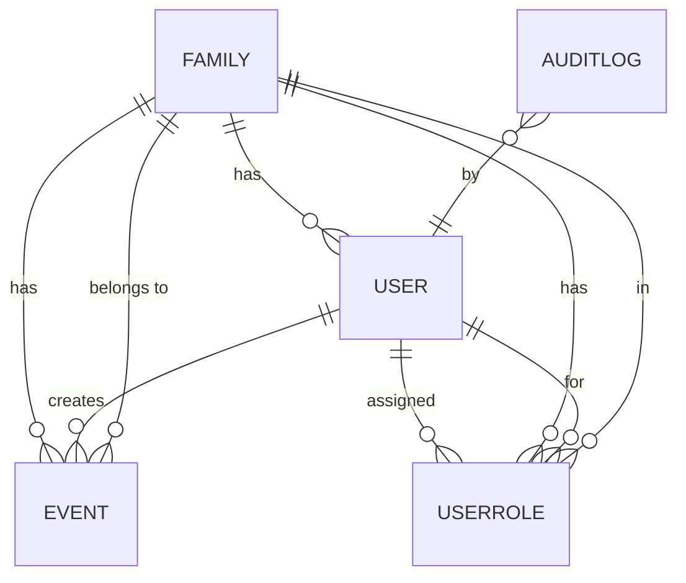

# BMAD Architecture: Family Planning & Calendar Integration

---

## 1. System Architecture Blueprint

- The SERA Family Planning Hub is a privacy-first, GDPR-compliant, modular web application for family calendar management.
- **Core stack:** React (TypeScript), Zustand, Tailwind CSS, Supabase (Postgres, Auth, API), Google Calendar API.
- **Architecture diagrams:** See `docs/architecture/README.md` for high-level and component/module diagrams (Mermaid and PNG).

---

## 2. Component & Module Breakdown

**Frontend Application**
- React app with Zustand state management, localization, and accessibility
- Handles UI, onboarding, event management, and role-based flows

**Supabase Backend**
- User, family, and event management
- RBAC and privacy enforcement at API/DB level
- Data residency in EU

**Calendar Integration Layer**
- Google Calendar sync (OAuth 2.0, API)
- Modular for future iCal/CalDAV and school system APIs

**Localization & Accessibility**
- Multi-language support, regional formats, accessibility for all ages

**Security & Compliance Layer**
- Data encryption, GDPR, Digital Services Act, audit logging, user consent

**API Client & Integration Utilities**
- Unified API interface, error handling, caching, retry logic

---

## 3. Data Model & Entity Relationships

**Key Entities:**
- User, Family, Event, UserRole, AuditLog
- Family-centric, role-based, privacy-aware, and sync-ready

**Entity Relationship Diagram:**

---

## 4. API & Integration Design

- RESTful endpoints, JWT auth, RBAC, versioning, OpenAPI/Swagger docs
- Core endpoints for auth, user/family/event management, calendar sync, localization, audit/compliance
- Google Calendar integration (OAuth 2.0, sync, conflict resolution)
- Supabase for data, auth, and RBAC
- Modular integration layer for future providers (iCal, school systems)

---

## 5. Security & Compliance Architecture

- Supabase Auth, JWT, RBAC, session expiration
- Data residency in EU, encryption at rest/in transit
- Minimal data collection, explicit user consent, GDPR rights (export, delete)
- Audit logs, incident response, regular security reviews
- Privacy-by-design and compliance with Digital Services Act

---

## 6. Scalability & Performance Planning

- Static asset hosting (Vercel/Netlify), code splitting, client-side caching
- Supabase/Postgres scaling, connection pooling, partitioning, indexing
- Stateless API, rate limiting, caching, async sync jobs
- Monitoring (frontend and backend), error/performance logging, user feedback
- High availability, backups, disaster recovery, modular/future-proof architecture

---

## 7. References

- See `docs/architecture/README.md` for diagrams and further details
- See PRD, project brief, and market research files for requirements and context

---

*This file serves as a single-source architecture summary for handoff, onboarding, and ongoing reference in the BMAD process.* 